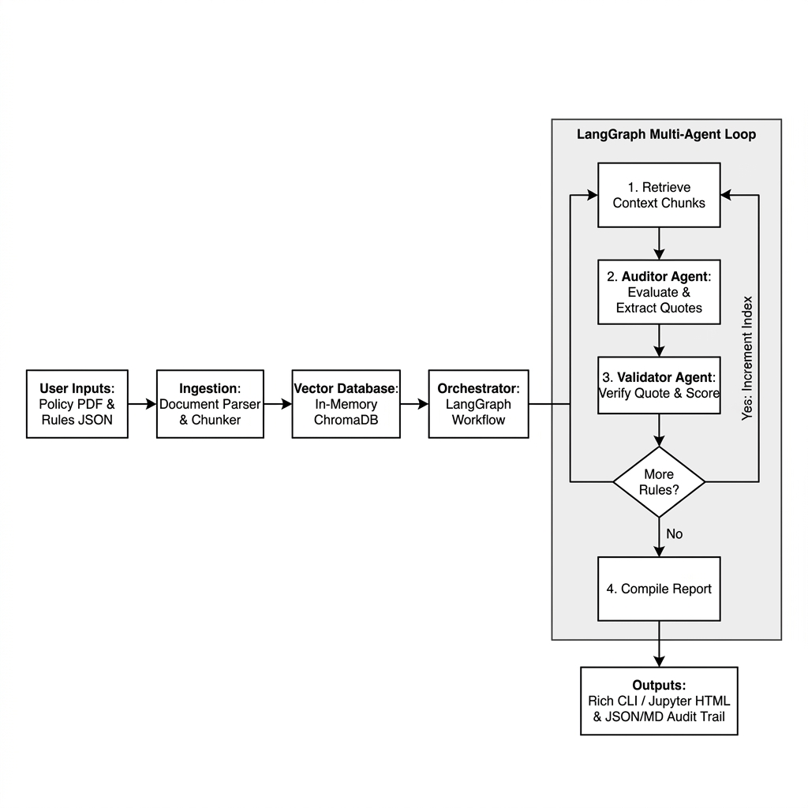

# AI-Driven Audit & Compliance Validator: Complete Workflow

This document details the complete technical architecture and end-to-end processing pipeline of the AI-Driven Audit & Compliance Validator project.

---

## 1. High-Level Architecture Flow

---

## 2. Technical Operations Phase-by-Phase

### Phase 1: Ingestion & Vector Indexing (RAG Pipeline)
1. **Rule Parsing**: The validator reads your compliance criteria from `rules.json` (Category, ID, Name, Description).
2. **Text Extraction**: The validator parses plain text (`.txt`) or extracts text from document PDFs (`.pdf` via `pypdf`).
3. **Recursive Chunking**: To ensure high semantic precision, the text is chunked using LangChain's `RecursiveCharacterTextSplitter` with a chunk size of 600 characters and an overlap of 100 characters.
4. **Vector Embeddings**: The text chunks are converted into numerical representations using a local HuggingFace embeddings model (`sentence-transformers/all-MiniLM-L6-v2`). This model runs locally on the **AMD Developer Cloud GPU** using PyTorch/ROCm.
5. **ChromaDB Caching**: The generated embeddings are loaded into an in-memory instance of **ChromaDB** to enable fast similarity lookups.

---

### Phase 2: Agentic Orchestration (LangGraph Flow)
The system leverages **LangGraph** to manage the state (`AuditState`) and control loops of our two agents (Auditor and Validator) as it audits each rule:

* **Node 1: `retrieve_node`**
  * Queries the in-memory ChromaDB using the name and description of the current compliance rule.
  * Fetches the top 3 most relevant segments of the policy and stores them in the graph state.

* **Node 2: `auditor_node`**
  * Triggers the primary auditor LLM agent with a targeted instruction prompt.
  * Inputs the current compliance rule and the retrieved policy chunks.
  * Evaluates compliance and returns:
    * **Status**: `PASS`, `FAIL`, `WARNING`, or `N/A`.
    * **Reasoning**: A detailed explanation of the decision.
    * **Evidence**: The exact verbatim quote extracted from the document supporting the choice.

* **Node 3: `validator_node` (Self-Reflection)**
  * Triggers the validation agent, which cross-checks the auditor's work.
  * **Quote Verification**: Checks if the extracted quote matches the original context verbatim (checks for AI hallucination).
  * **Logic Verification**: Confirms if the quote logically supports the pass/fail determination.
  * **Confidence Scoring**: Assigns a final rating from 0-100% based on the quote match and logical consistency.

* **Conditional Edge: `router_edge`**
  * Checks if all rules in the list have been audited.
  * If **Yes**, it directs the state to the final compilation.
  * If **No**, it increments the index pointer and loops the graph back to `retrieve_node`.

---

### Phase 3: Reporting & Auditable Trail Output
Once the LangGraph loop terminates, the compilation node aggregates all data:

1. **Terminal Console Dashboard**:
   * Renders a layout table in the command line using `rich`.
   * Displays the color-coded compliance status (`PASS [OK]`, `FAIL [X]`, `WARN [!]`, `N/A [-]`), confidence scores, and brief evidence highlights.
2. **Jupyter Notebook HTML Dashboard**:
   * Uses HTML/CSS styled output boxes directly in Jupyter.
   * Renders details inside easy-to-read green, red, or orange cards for quick auditing review.
3. **Auditable Artifact Storage**:
   * **`audit_report.json`**: An exportable machine-readable file containing full timestamps, validation scores, and reasoning.
   * **`audit_report.md`**: A clean markdown document summarizing findings, ready for distribution.
